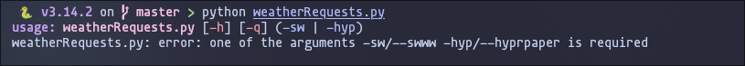
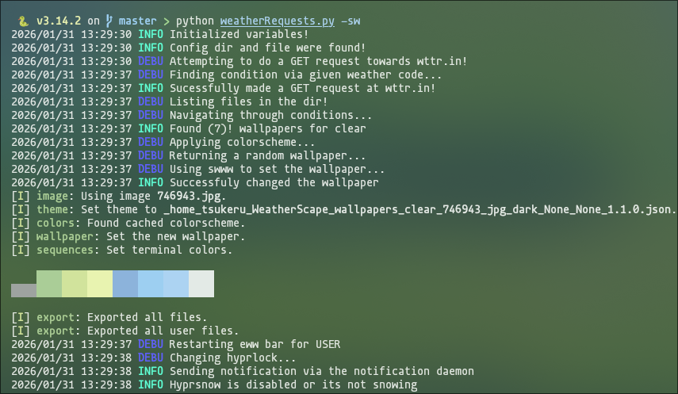
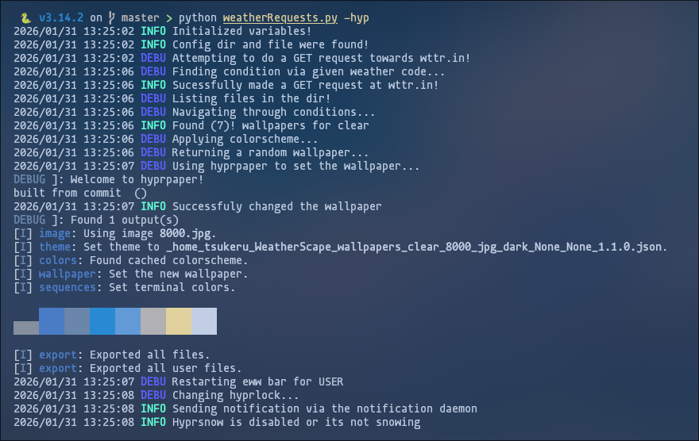
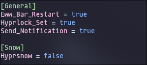

# WeatherScape ☁️
  *The readme will be updated soon to include the newest updates and features*
  
  - **WeatherScape aims to enhance your experience as a wayland user, by providing you with a cozy setup that matches the weather**

  [](https://github.com/user-attachments/assets/22e69dc9-a539-4c22-b152-a85940f6d533)
  
  - **The above video shows the demo, as seen weatherscape has generated a theme that matches the local weather, currently where i am, its sunny and clear**
  - **WeatherScape proceeded to configure my hyprlock, restart eww, send a notification everytime the program runs and the theme changes**

  - **For further evidence, here is a picture taken from when the demo was recorded**

  <details>
  <summary>Evidence</summary>
  
  
    
  </details>
  
  <details>
  <summary>Preview 👀</summary>

  https://github.com/user-attachments/assets/c5c9ac89-2792-427c-ad8d-a8adba2992ed
    
  

  - **⚠️ More arguements are yet to come as more functionality is included**

  
  
  - **WeatherScape runs properly if either wallpaper managers: swww and hyprpaper, were specified**

  
  
  - **In this example. the swww wallpaper manager was used**
    
  - **As seen, pywal is also applied (if installed)**

  
  
  - **This image corresponds to the output above, this is a direct result of swww**

  
  
  - **In this example. the hyprpaper wallpaper manager was used**

  
  
  - **This image corresponds to the output above, this is a direct result of hyprpaper**

  
  
  - **Here is a preview for the quiet mode, as seen, ZERO logging giving your terminal a clear look**
    
  - **⚠️ Errors may interrupt!**

  
  
  - **Using quiet mode does not alter the outcome!**

  
  
  - **A neat demonstration of how the pywal applies the theme exemplified by the cava visualizer**

  - **The previous examples show how WeatherScape sets the theme according to the weather, in my case my weather at that time was Sunny, and so the wallpapers returned emit that vibe**

  

  </details>


  <details>
  <summary>Features ✨</summary>

  - **A neat feature of WeatherScape is that it comes with a config file**
    
  - **In this config file the user can adjust the behaviour of the program, the config file is as follows**

    

    - **Allow WeatherScape change the hyprlock background according to the wallpaper**
        
    - **Allow WeatherScape to send a notification every time the program is ran**
        
    - **Allow WeatherScape to restart Eww bar when wallpaper is set**
        
    - **For snowy weathers, WeatherScape allows you to enable hyprsnow, this adds a nice aesthetic whenever its currently snowing outside**
        
  </details>
  
  <details>
  <summary>The purpose 🎯</summary>
    
  - **The primary purpose of weatherscape is to change your hyprland/wayland setup according to your local weather**
  
  - **This program is especially useful for people who love to customize their setup**
  
  - **People who find a need for this program are those who find coziness on their setup and love to match the weather**
  </details>
  
  <details>
  <summary>How it works 🛠️</summary>
    
  - **A GET request is made towards wttr.in which returns local forecast data. Inside of the json structured data includes weathercodes and other valuable information**
    
  - **WeatherScape stores multiple weather codes in a dictionary in a key-value pair relationship, where the value is a set of weather codes and the key is the classification**
    
  - **WeatherScape then filters through them according to the json file request, and finds which classification does the weather code belong to**
    
  - **WeatherScape comes with stored wallpapers, you can change them to fit your needs, and find wallpapers that you want to have during a specific weather condition**
  </details>

  <details>
  <summary>Installation 📦</summary>

  - **For most distros, the installation is quite simple, run the install script and wait for the script to detect your distro...**
    
  - **Supported distros are as follows:**  
      - **Fedora and other red hat based distros**
      - **Arch and endeavourOS other arch based distros**
      - **Ubuntu**
  - **For other distros refer to the dependencies and install them manually, dependencies will be listed below...**

    <details>
    <summary>Installation for listed distros ⬇️</summary>
    
    - **⚠️ Please note that this installation below is meant for the people that have their distro listed above!**
    
    ```bash
      git clone https://github.com/Tsukeruu/WeatherScape && \
        cd WeatherScape && \
        ./INSTALL.sh
    ```
    </details>
    <details>
    <summary>Installation for non listed distros ⚙️</summary>
      
      - **For people who do not have their distros listed above please install these required dependencies**
        - **Swww**
        - **Pywal**
        - **go**
        - **Hyprlock (Though not usually required because its optional)**
        - **Hyprsnow (If you wish to receive the snowy effect, however this is optional as well, exclusive to hyprland users)**
        - **Eww (Optional as well, if you use eww as a bar it will be optional)**
    </details>
    
  </details>


  <details>
  <summary>Usage 🧠</summary>
    
  - **After installation, cd into weatherscape and run the python script, (not in the utils dir)**
  - ```bash
    cd WeatherScape && python weatherRequests.py
    ```
    **For any errors please refer to the issues tab and ill gladly guide you on how to debug**
  </details>

  <details>
  <summary>Disclaimer ⚠️</summary>
    
  - **WeatherScape runs solely on the internet connection, which works in a direct relationship**
    
  - **The faster internet you have, the faster the GET request will be**
    
  - **Returned data may not be accurate as this may be a problem with your location or in the wttr.in backend**

  - **Often times, if wttr.in cannot locate your location, likely due to an issue in the backend, it will fallback to california**

  - **To fix such errors, specify the location manually by changing the base api endpoint to point to your location**
  
  - **Do not be surprised if the program returns an inaccurate weather result, its simply an issue regarding wttr.in**

  - **Hyprsnow is disabled by default due to performance prioritization, enable it in the config file and re run the program to submit the changes**

  - **If for any case the changes were reverted when closing the terminal, its simply because the py wal colorscheme hasnt been set for the terminal**
    
  </details> 
