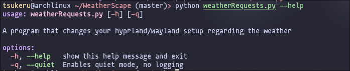
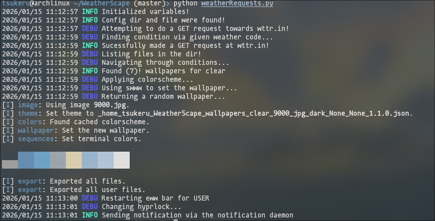
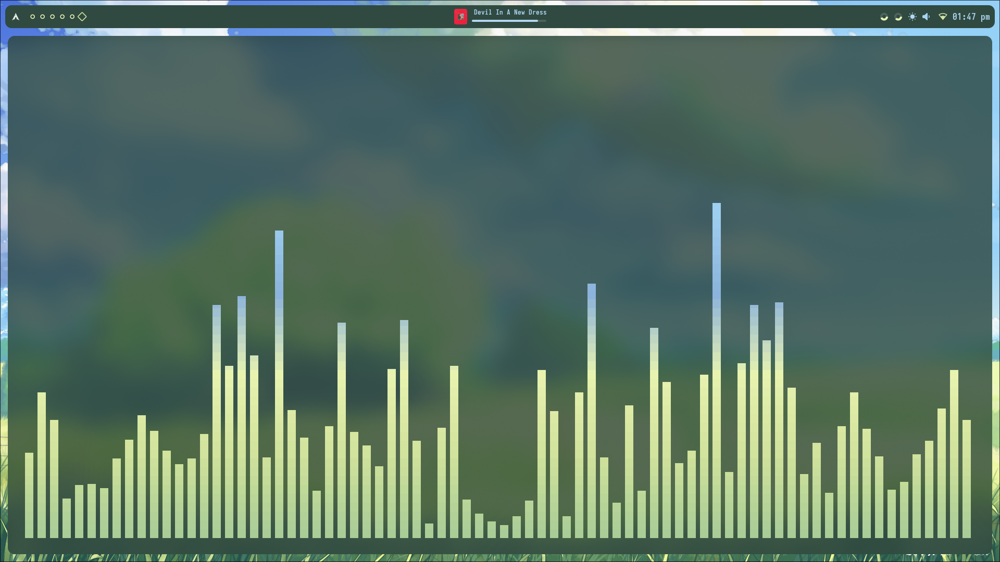

# WeatherScape ☁️
  - **WeatherScape aims to enhance your experience as a wayland user, by providing you with a cozy setup that matches the weather**

  

  
Preview 👀

    
  
  
  - **⚠️ More arguements are yet to come as more functionality is included**

  
  
  - **WeatherScape comes with beautiful logging that comes from charmbracelets' log library**

  
  
  - **WeatherScape sets the wallpaper using Swww, this image corresponds to the image above**
    
  - **As seen, pywal is also applied (if installed)**

  
  
  - **Here is a preview for the quiet mode, as seen, ZERO logging giving your terminal a clear look**
    
  - **⚠️ Errors may interrupt!**

  
  
  - **Here is a preview of how it looks from the quiet mode... This image corresponds to the image above**

  
  
  - **A neat demonstration of how the theme is applied using the cava visualizer**

  - **The previous examples show how WeatherScape sets the theme according to the weather, in my case my weather at that time was Sunny, and so the wallpapers returned emit that vibe**
  

  

  
Features ✨

  - **A neat feature of WeatherScape is that it comes with a config file**
    
  - **In this config file the user can adjust the behaviour of the program, the config file is as follows**

    - **Allow WeatherScape change the hyprlock background according to the wallpaper**
        
    - **Allow WeatherScape to send a notification every time the program is ran**
        
    - **Allow WeatherScape to restart Eww bar when wallpaper is set**
        
    - **For snowy weathers, WeatherScape allows you to enable hyprsnow, this adds a nice aesthetic whenever its currently snowing outside**
        
  

  
  

  
The purpose 🎯

    
  - **The primary purpose of weatherscape is to change your hyprland/wayland setup according to your local weather**
  
  - **This program is especially useful for people who love to customize their setup**
  
  - **People who find a need for this program are those who find coziness on their setup and love to match the weather**
  

  
  

  
How it works 🛠️

    
  - **A GET request is made towards wttr.in which returns local forecast data. Inside of the json structured data includes weathercodes and other valuable information**
    
  - **WeatherScape stores multiple weather codes in a dictionary in a key-value pair relationship, where the value is a set of weather codes and the key is the classification**
    
  - **WeatherScape then filters through them according to the json file request, and finds which classification does the weather code belong to**
    
  - **WeatherScape comes with stored wallpapers, you can change them to fit your needs, and find wallpapers that you want to have during a specific weather condition**
  

  

  
Disclaimer ⚠️

    
  - **WeatherScape runs solely on the internet connection, which works in a direct relationship**
    
  - **The faster internet you have, the faster the GET request will be**
    
  - **Returned data may not be accurate as this may be a problem with your location or in the wttr.in backend**

  - **Often times, if wttr.in cannot locate your location, likely due to an issue in the backend, it will fallback to california**

  - **To fix such errors, specify the location manually by changing the base api endpoint to point to your location**
  
  - **Do not be surprised if the program returns an inaccurate weather result, its simply an issue regarding wttr.in**
    
  

  
